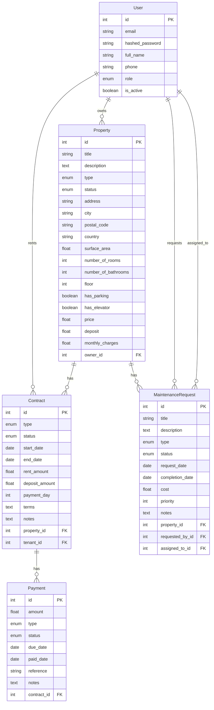

# Modèle Conceptuel de Données (MCD)

Ce document décrit le modèle conceptuel de données de l'application de gestion immobilière.

## Diagramme

## Description des Entités

### User (Utilisateur)
- Représente tous les utilisateurs du système
- Peut avoir différents rôles (admin, agent, propriétaire, locataire)
- Peut être propriétaire de plusieurs propriétés
- Peut être locataire dans plusieurs contrats
- Peut faire des demandes de maintenance
- Peut être assigné à des demandes de maintenance

### Property (Propriété)
- Représente un bien immobilier
- Appartient à un utilisateur (propriétaire)
- Peut avoir plusieurs contrats (historique)
- Peut avoir plusieurs demandes de maintenance
- Contient des informations détaillées sur les caractéristiques physiques et financières

### Contract (Contrat)
- Lie une propriété à un locataire
- Peut avoir plusieurs paiements
- Définit les conditions de location
- Inclut les montants du loyer et de la caution
- Spécifie le jour de paiement mensuel

### Payment (Paiement)
- Représente un paiement lié à un contrat
- Peut être de différents types (loyer, caution, charges, etc.)
- A un statut (en attente, payé, en retard, annulé)
- Inclut des dates importantes (échéance, paiement)
- Peut avoir une référence et des notes

### MaintenanceRequest (Demande de maintenance)
- Représente une demande de maintenance pour une propriété
- Est créée par un utilisateur
- Peut être assignée à un utilisateur
- A un type, un statut et une priorité
- Inclut des informations sur les coûts et les dates

## Relations

1. **User - Property** (1:N)
   - Un utilisateur peut posséder plusieurs propriétés
   - Une propriété appartient à un seul utilisateur

2. **User - Contract** (1:N)
   - Un utilisateur peut être locataire dans plusieurs contrats
   - Un contrat est associé à un seul locataire

3. **Property - Contract** (1:N)
   - Une propriété peut avoir plusieurs contrats (historique)
   - Un contrat est associé à une seule propriété

4. **Contract - Payment** (1:N)
   - Un contrat peut avoir plusieurs paiements
   - Un paiement est associé à un seul contrat

5. **Property - MaintenanceRequest** (1:N)
   - Une propriété peut avoir plusieurs demandes de maintenance
   - Une demande de maintenance est associée à une seule propriété

6. **User - MaintenanceRequest** (1:N)
   - Un utilisateur peut faire plusieurs demandes de maintenance
   - Un utilisateur peut être assigné à plusieurs demandes de maintenance
   - Une demande de maintenance est créée par un utilisateur
   - Une demande de maintenance peut être assignée à un utilisateur

## Contraintes

1. **Intégrité référentielle**
   - Toutes les clés étrangères doivent référencer des enregistrements existants
   - La suppression d'un enregistrement parent doit être gérée (cascade ou restriction)

2. **Unicité**
   - L'email d'un utilisateur doit être unique
   - Les références de paiement doivent être uniques

3. **Validation**
   - Les montants doivent être positifs
   - Les dates de fin doivent être postérieures aux dates de début
   - Les priorités de maintenance doivent être comprises entre 1 et 5 